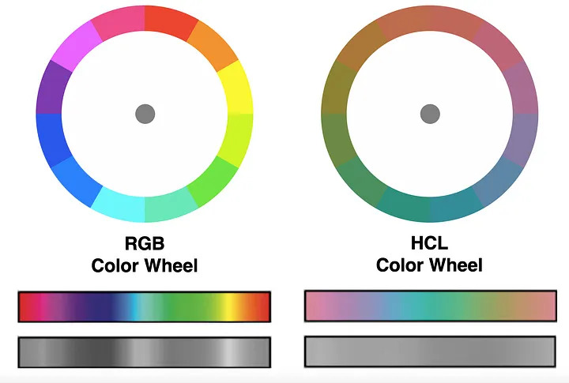

# Data Visualization

Data visualization is an essential tool for understanding and
communicating complex information. R, a powerful programming language
for data analysis, offers a variety of packages for creating visually
appealing and informative plots. One of the most popular and versatile
packages for data visualization in R is `ggplot2`. In this introduction,
we will explore the basics of using `ggplot2` to create different types
of plots and customize them to suit your needs. We can load it
separately `libary(ggplot2)` or with `libary(tidyverse)`.

We will continue using the example from the previous vignette. If you
used R before then you are familiar with the default graphing function
`plot`,`hist`, etc. `ggplot2` has it own version of quickly making a
graph `qplot()`. To learn about `qplot()` check out [this
vignette](http://www.sthda.com/english/wiki/qplot-quick-plot-with-ggplot2-r-software-and-data-visualization).

    data_raven %>% pull(pr_correct) %>% hist() 

    data_raven %>% qplot(pr_correct, data = ., geom = 'histogram', bins = length(unique(data_raven$pr_correct)))

## `ggplot()`

The ggplot() function sets up the basic structure of a plot, and
additional layers, such as points, lines, and facets, can be added using
`+` operator (like `%>%`, but for `+`). This makes it easy to
understand, modify the code, and build complex plots by adding layers.
This allows for easy creation of plots that reveal patterns in the data.
In contrast, the basic R plotting functions and qplot() have a simpler
and less expressive syntax, making it harder to create complex and
multi-layered plots. Mastering ggplot() is well worth your time and
effort as it will teach you how to think about graphs and what goes into
building them. For example, let’s improve the histogram from earlier!

    data_raven %>% 
      count(pr_correct) %>% # I prefer calculating statistics myself
      ggplot(aes(x = as.factor(pr_correct), y = n)) + # We use aes to set x and y
      geom_col(fill = "steelblue") +
      theme_minimal(base_size = 15) + 
      theme(panel.grid = element_blank(), 
            panel.grid.major.y = element_line(size = 0.5, linetype = 2, color = "grey")) +
      labs(x = "Number of Correct Answers", 
           y = "Subject Count", 
           title = "Distribution of Correct Answers in Piece-rate Game")

Ah much better! We added labels, removed unnecessary grid lines, and
added some color. If you want to learn more about ggplot check out
[ggplot2: Elegant Graphics for Data Analysis](https://ggplot2-book.org))
and [the
cheatsheet](https://posit.co/wp-content/uploads/2022/10/data-visualization-1.pdf).

We will use an amazing package `esquisse` to build our plots with
drag-and-drop!

    # install.packages('esquisse')
    library(esquisse)

You can access `esquisse` by going to “Addins” in the top panel or with
`esquisser(your_data)`. Now go learn more about this package
[here](https://cran.r-project.org/web/packages/esquisse/vignettes/get-started.html).

## Easy Color Guide

Color is a crucial component of data visualization. It has the power to
evoke emotions, highlight patterns, and communicate information that
might be difficult to convey through other means. Effective use of color
in data visualization can enhance the viewer’s understanding and
engagement with the data, while poor use of color can obscure important
information and create confusion. We will learn how to easily create
different color schemes and palettes.

Color is a powerful tool for data visualization because it can help
convey information quickly and effectively. By using different colors to
represent different data points or categories, we can create visual
patterns that are easy to interpret and remember. Color can also be used
to highlight specific data points or draw attention to important trends
or outliers in the data. Additionally, color can make data
visualizations more engaging and appealing, which can help hold viewers’
attention and make them more likely to understand and remember the
information being presented.

### Highlight Important Point

    ## `summarise()` has grouped output by 'year'. You can override using the `.groups` argument.

### Comparing Two Things

#### Complementary Harmony with a Positive/Negative Connotation

Complementary Harmony refers to the use of colors that are opposite to
each other on the color wheel to create a strong contrast. This creates
a positive/negative connotation that is good for showcasing differences.
Colors near each other on the wheel can also work well together, but
opposite colors provide the strongest support for a key color.

#### Near Complementary Harmony for Highlighting Two Series Where One Is the Primary Focus

Near Complementary Harmony is a color scheme that creates good contrast
without using polar opposite colors. It involves selecting a color that
is 33% around the color wheel from the key color instead of the full
50%. This works well for highlighting two series where one is the
primary focus. It is best to use warm colors for the key color and cool
colors for the complementary colors. If necessary, the complementary
colors can be muted by decreasing their saturation or altering their
lightness to reduce the contrast with the background.

### Color Palettes for Comparing Three Things

#### Analogous/Triadic Harmony for Highlighting Three Series

Analogous harmony involves using neighboring colors to the key color for
simple distinctions among categories. In contrast, triadic harmony uses
the key color and two complementary colors evenly spaced around the
color wheel for greater contrast, but may lose the emphasis on the key
color.

#### Highlighting One Series Against Two Related Series

Near Complementary Harmony is a color scheme that creates good contrast
without using polar opposite colors. It involves selecting a color that
is 33% around the color wheel from the key color instead of the full
50%. This works well for highlighting two series where one is the
primary focus. It is best to use warm colors for the key color and cool
colors for the complementary colors. If necessary, the complementary
colors can be muted by decreasing their saturation or altering their
lightness to reduce the contrast with the background.

### Color Palettes for Comparing Four Things

#### Analogous Complementary for One Main Series and Its Three Secondary

Analogous Complementary is a color scheme that uses four colors, where
the key color and its complementary color are combined with two colors
that are one step away from the complementary color. This scheme still
allows for analogous harmony while creating a quartet of colors that can
be used for one main series and its three components. The similarities
between the three complementary colors make the key color stand out.

#### Double Complementary for Two Pairs Where One Pair Is Dominant

Double Complementary Harmony is a color scheme suitable for four
different data series that are divided into two groups of two series.
The scheme involves selecting the key color and one of its two adjacent
colors on the color wheel. Then, choose the complements of both the key
color and its adjacent color to serve as their respective partners. It
is recommended that the key color and its adjacent color be warmer
colors, while the complementary colors should be cooler colors. This
scheme works well for highlighting two pairs where one pair is dominant.

#### Rectangular or Square Complementary for Four Series of Equal Emphasis

Rectangular or Square Complementary is a color scheme suitable for four
series of equal emphasis where the objective is to use colors to make
categorical distinctions. This scheme involves selecting the key color
and its complementary color, but unlike the double complementary scheme,
two additional colors are added to create a rectangle or square on the
color wheel. The resulting colors create a clear distinction between the
four series. This scheme is similar to double complementary but works
better when all four series are of equal importance.

\### Sequential and Divergent

Sequential colors are a gradient of colors from light to dark, assigned
to numeric values, based on hue or lightness. The colors depend on the
background, with lower values assigned lighter colors, and higher values
assigned darker colors. A single hue or a sequence of hues can be used.

Let’s use our beloved purple to GDP of different countries.

#### Sequential

\#### Divergent Diverging color schemes are used when the numeric
variables have a meaningful central value such as zero. They combine two
sequential palettes with a shared endpoint that rests on the central
value, with positive values assigned colors on one side and negative
values on the other side. The central value should have a light color so
that darker colors can indicate more distance from the center. It is
important to keep the color scheme simple to avoid diluting the meaning
and confusing the audience. Proper use of colors can reduce the
cognitive load and help people understand complex information more
easily.

### Prebuilt

Prebuilt color scales like “Viridis” are designed with perceptual
uniformity in mind, which makes them visually appealing and easy to
interpret. They provide a consistent and standardized color scheme,
eliminating the need for custom design and testing. In addition,
prebuilt color scales can help people with color blindness to better
interpret data visualizations, as they use colors with consistent visual
contrast. Using prebuilt color scales can help ensure that data
visualizations are accessible to the widest possible audience.

### Color Systems

There are several popular color systems that are commonly used in
digital design and data visualization. The sRGB color system is the
standard color space used for displaying images and graphics on digital
displays. It is a device-dependent color space that is designed to
provide consistent color reproduction across a wide range of devices.
The HCV color system is based on hue, chroma, and value, and is used to
create visually distinct color palettes for use in data visualization.
The HSL color system is based on hue, saturation, and lightness, and is
often used to create color palettes for web design and user interfaces.
The LAB color system is a device-independent color space that is
designed to accurately represent colors across different devices and
environments. It is often used in professional printing and color
management applications. Each of these color systems has its own
strengths and weaknesses, and the choice of which one to use depends on
the specific needs of the project.

To see how these spaces look, check out [this amazing
video](https://www.youtube.com/watch?v=HlDySNpGbyc)!

#### HSL

The HSL color system describes colors using three parameters: hue,
saturation, and lightness. Hue is represented by a value from 0 to 360
degrees on the color wheel, and determines the basic color of the pixel.
Saturation represents the purity of the hue, or how much gray is mixed

into the color. Saturation ranges from 0% (gray) to 100% (pure hue).
Lightness, on the other hand, represents the amount of white or black
mixed with the color, with 0% being black, 50% being the original color,
and 100% being white. HSL is often used in graphic design and web
development, as it allows for the easy selection of colors based on hue,
saturation, and lightness. However, it has some limitations, such as not
being perceptually uniform, meaning that changes in the numeric values
of the parameters may not correspond to equal changes in the perceived
color.

#### HSV

The HSV color system describes colors using three parameters: hue,
saturation, and value. Hue is represented by a value from 0 to 360
degrees on the color wheel, and determines the basic color of the pixel.
Saturation represents the purity of the hue, or how much white or gray
is mixed into the color. Saturation ranges from 0% (gray) to 100% (pure
hue). Value represents the brightness of the pixel, with 0% being black
and 100% being the brightest possible color. The HSV color system is
often used in graphics and image editing software, as it allows for easy
selection of colors based on the hue, saturation, and value parameters.
However, it has some limitations, such as not being perceptually
uniform, meaning that changes in the numeric values of the parameters
may not correspond to equal changes in the perceived color.

#### LAB

The LAB color system is a device-independent color space that is
designed to accurately represent colors across different devices and
environments. It consists of three parameters: L (lightness), a (the
position between red/magenta and green), and b (the position between
yellow and blue). The L parameter represents the brightness of the
color, ranging from 0 (black) to 100 (white). The a and b parameters
represent the color channels, with positive values representing colors
in the red and green, and yellow and blue directions, respectively, and
negative values representing colors in the opposite directions. The LAB
color space is used in professional printing and color management
applications, as it allows for accurate color matching across different
devices and environments. Additionally, more recent LAB color spaces
(ex. OKLAB) are perceptually uniform, meaning that equal distances in
LAB color space correspond to equal steps in perceived color difference.

#### OKLAB

OKLAB is a color space designed to be more perceptually uniform than
other color spaces like sRGB or LAB. It uses an opponent color model,
where the color information is encoded L – perceived lightness a – how
green/red the color is b – how blue/yellow the color is. This means that
the OKLAB color space can accurately represent colors while maintaining
perceptual uniformity. OKLAB was developed to address the limitations of
other color spaces. The use of OKLAB is becoming increasingly popular in
digital design and data visualization, as it can provide more accurate
and consistent color representation. You can learn about OKLAB from the
video folder.

### Perceptual Uniformity

Humans are not machines, we wee see things with our eyes and process
them with our brain. What might appear like a similar color to a machine
for humans will not. As an example, below are two color wheels one is
RGB (perceptually non-uniform) and the other is HCL (uniform). When the
color spectra are viewed in Gray scale the uneven nature of RGB becomes
apparent.

#### Warning Colormaps might Increase Risk of Death!

In its infancy in 1990s data visualization as field adopted Rainbow
Color Map with the most famous variation being Jet as default palette.
Many researchers expressed concerns as the non-uniform nature of the
palette introduced transitions that could be perceived incorrectly.

Rogowitz and Treinish raised concerns about the Rainbow Color Map in
1998 “Data Visualization: The End of the Rainbow”, and Borland and
Taylor highlighted additional concerns in a 2007 paper “Rainbow Color
Map (Still) Considered Harmful”. In 2011, Borkin and her team conducted
user studies on the application of various color maps, including the
Rainbow Color map, to medical visualization problems. Their findings in
“Evaluation of Artery Visualizations of Heart Disease Diagnosis” showed
that a perceptually uniform color map resulted in fewer diagnostic
errors than the Rainbow Color map. So, diagnostic errors could be
reduced by simply switching to a proper color palette. The problem of
misuse of color still persists as overviewed by Crameri, Shephard and
Heron in “The misuse of colour in science communication” (2020).

 All of these issues are amplified
once we consider that roughly 8% of all men and 0.5% of all women are
colorblind. There three main forms of red(protan), gren(deutan), and
blue (tritan) disorders, corresponding to color sensitive cones in our
eyes. To check whether your visualization is colorblind friendly use
[Coblis](https://www.color-blindness.com/coblis-color-blindness-simulator/)
and vary value across colors.

#### So what should you use?

A simple answer would be HSL, because it is the most intuitive one and
the easiest to make color pairs it. A more complicated answer would be
OKHSL, which is a child of OKLAB and HSL producing a perceptually
uniform HSL space. Try out both of them and see the difference
[here](https://bottosson.github.io/misc/colorpicker/). Or even a better
choice find a tested color scheme that you find pretty and use it as
your default.

### Where do I find color waves?

[Adobe Color](https://color.adobe.com/create/color-wheel) - Adobe Color
let’s you create color palettes using different color harmony rules and
color modes. You can also pick colors from your image, make gradients
from images, and test for accessibility.

[Paletton](https://paletton.com/) - Amazing tool for creating color
palettes

[Color Brewer](http://colorbrewer2.org/) - Color Brewer is a web-based
tool that provides color schemes perceptual uniform for maps and data
visualizations.

[Color Thief](https://lokeshdhakar.com/projects/color-thief/) - Color
Thief let’s you extract colors from your image to create nature-inspired
palettes.

[Viz Palette](https://projects.susielu.com/viz-palette) - Viz Palette
can be used to check your color palettes before creating visualizations.
It allows you to view color sets in example plots, simulate color
deficiencies, and modify the colors of your palette.
